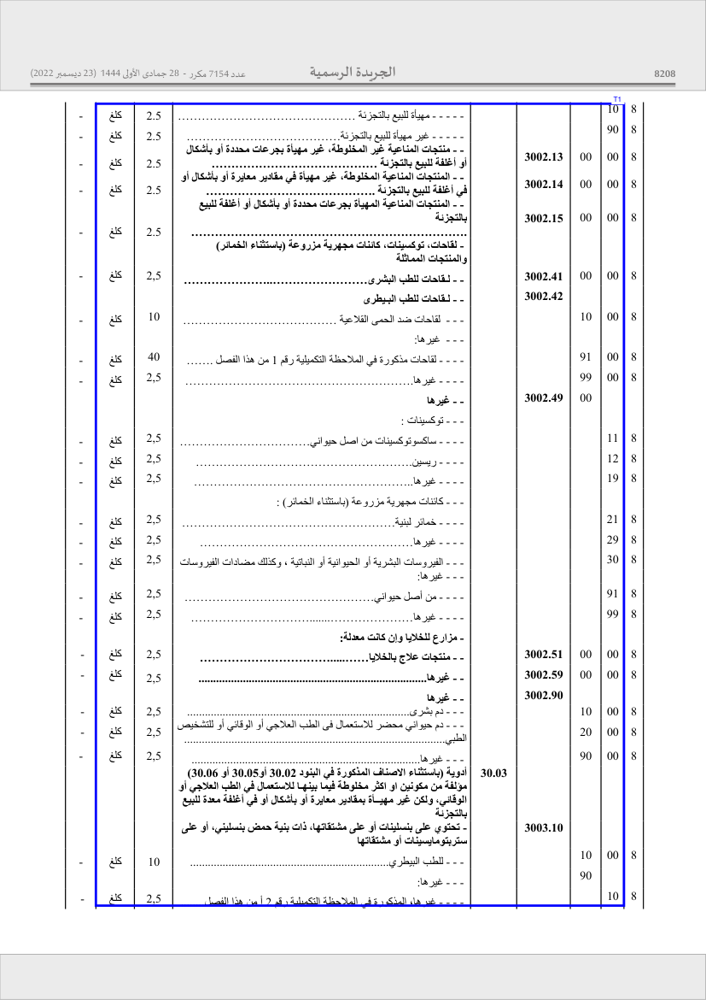
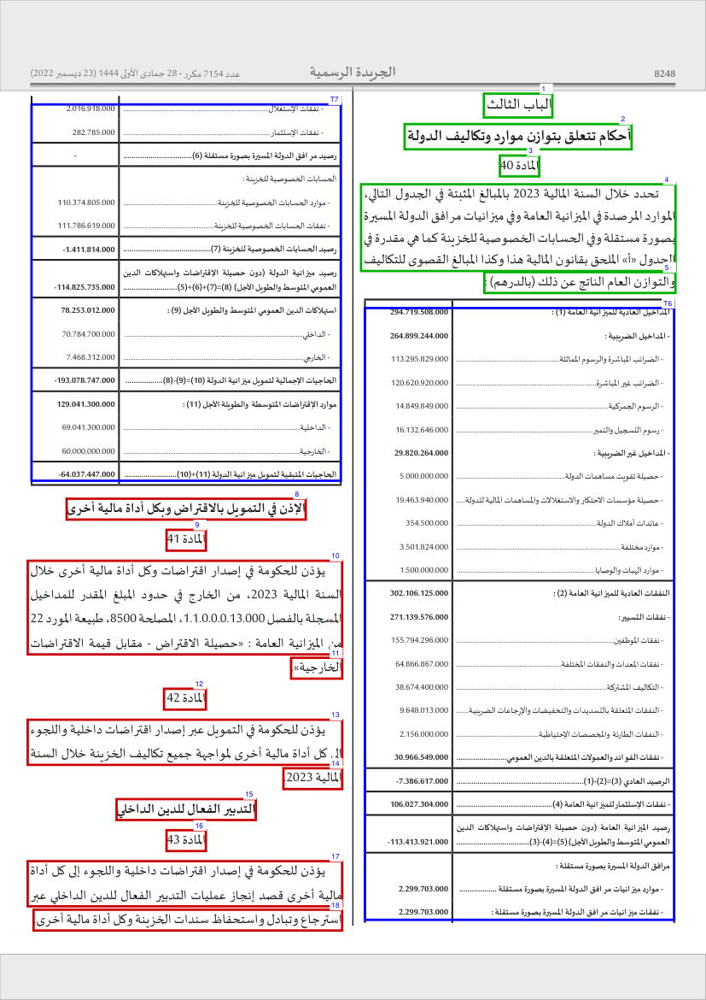
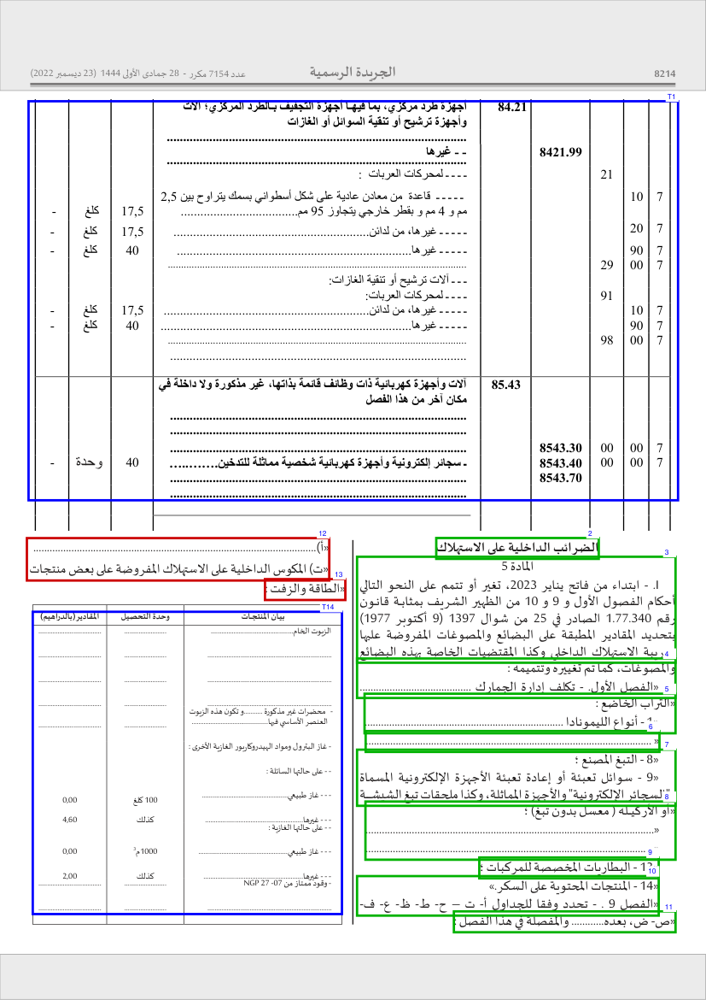

# PDF2Text-Arabic

Arabic PDF text extraction built on PyMuPDF. Fixes ligature decomposition, RTL ordering, table extraction, and other issues that make raw PyMuPDF output unusable for Arabic.

## What it fixes

| # | Problem | Fix |
|---|---------|-----|
| 1 | **Ligature decomposition** — PyMuPDF breaks Arabic ligatures (الله, لأ, لإ) into LTR-ordered zero-width chars | Detects zero-width clusters, reverses to RTL order |
| 1b | **Lam-Alef swap** — لا ligature decomposed as ال (alef before lam) | Detects width ratio, swaps to correct order |
| 2 | **Presentation Forms** — Returns U+FB50–FDFF / U+FE70–FEFF instead of standard Arabic | NFKC normalization |
| 3 | **Line splitting** — One visual line split into multiple rawdict lines at same y | Y-coordinate merging with tolerance |
| 4 | **Number reversal** — RTL sorting reverses digit sequences (2019 → 9102) | Detects LTR digit runs, reverses back |
| 5 | **Arabic↔digit spacing** — No space between Arabic text and numbers | Regex-inserts spaces at boundaries |
| 6 | **Artifact spaces** — Space chars with overlapping bboxes cause false word breaks | Only honors spaces with physical gaps > 0.5px |
| 7 | **Invisible chars** — Zero-width joiners, BOM, LTR/RTL marks, kashida | Stripped in post-processing |

## Install

```bash
pip install pdf2text-arabic
```

From source:
```bash
pip install .
# or with uv
uv pip install .
```

## Quick start

### Python API

```python
from pdf2text_arabic import extract_pdf, extract_page

# Extract entire PDF
text = extract_pdf("document.pdf")

# With cropping (remove headers/page numbers)
text = extract_pdf("document.pdf", crop_top=50, crop_bottom=30)

# Crop by percentage
text = extract_pdf("document.pdf", crop_top=5, crop_bottom=3, crop_unit="pct")

# Disable footnote separator detection
text = extract_pdf("document.pdf", detect_footer=False)
```

### AI-friendly API (recommended for agents)

```python
from pdf2text_arabic import extract_pdf_result, get_capabilities

caps = get_capabilities()
result = extract_pdf_result("document.pdf", on_empty="warn")

print(result.pages_total)
print(result.pages_with_text)
print(result.empty_pages)
print(result.warnings)
print(result.text)
```

Agent contract:
- Prefer `extract_pdf_result()` over parsing logs.
- Do not manually reorder Arabic text after extraction.
- Use `get_capabilities()` before enabling OCR-specific behavior.

### Single page

```python
import fitz
from pdf2text_arabic import extract_page

doc = fitz.open("document.pdf")
text = extract_page(doc[0], crop_top=50, crop_bottom=30)
doc.close()
```

### CLI

```bash
# Process all PDFs in a directory
pdf2text-arabic -i ./download -o ./output/plain_text

# Single file
pdf2text-arabic -f document.pdf -o ./output

# With cropping
pdf2text-arabic -i ./download --crop-top 50 --crop-bottom 30

# Crop by percentage, no footer detection
pdf2text-arabic -i ./download --crop-top 5 --crop-bottom 3 --crop-unit pct --no-footer
```

## API reference

### `extract_pdf(pdf_path, **kwargs) → str`

Extract text from all pages of a PDF.

| Parameter | Type | Default | Description |
|-----------|------|---------|-------------|
| `pdf_path` | `str` | — | Path to the PDF file |
| `crop_top` | `float` | `0` | Crop from top of each page |
| `crop_bottom` | `float` | `0` | Crop from bottom of each page |
| `crop_unit` | `"px" \| "pct"` | `"px"` | Unit: points or percentage of page height |
| `detect_footer` | `bool` | `True` | Auto-detect footnote separator lines and exclude content below |
| `on_empty` | `"ignore" \| "warn" \| "auto" \| "ocr"` | `"warn"` | Handle image-only pages. `"auto"` attempts text then uses Gemini OCR for images. `"ocr"` forces full-page Gemini OCR. |
| `table_strategy` | `str \| None` | `None` | Strategy for PyMuPDF table detection (e.g. `"lines"`, `"text"`) |
| `gemini_model` | `str` | `"gemini-3-flash-preview"` | Google Gemini model to use when `on_empty` is `"auto"` or `"ocr"`. Requires `GEMINI_API_KEY`. |

### `extract_page(page, **kwargs) → str`

Extract text from a single `fitz.Page`. Same parameters as `extract_pdf` (except `pdf_path`).

### `extract_pdf_result(pdf_path, **kwargs) → ExtractionResult`

Structured output for AI/automation:

- `text`: final extracted text
- `pages_total`: total page count
- `pages_with_text`: number of non-empty extracted pages
- `empty_pages`: list of page numbers that produced empty output
- `mixed_pages`: list of page numbers that contain extractable text AND image blocks requiring OCR
- `warnings`: machine-readable warning tokens (example: `empty_page:3`, `mixed_page:1`)

## Features

### Table extraction

Tables are automatically detected via PyMuPDF's `find_tables()`, extracted with proper Arabic cell ordering, and formatted as plain CSV-style text where columns are explicitly separated by a pipe character (` | `). 

This format is structurally robust for LLM ingestion (RAG pipelines) because it doesn't rely on guessing headers, safely handles empty cells via consecutive pipes (` | | `), and merges split rows naturally. Merged cells are filled down so every row is self-contained:

```text
الرقم | بيان الحسابات | نفقات سنة 2023
3.2.0.0.4.13.022 | حساب الإنخراط في الهيئات العربية والإسلامية | 137 362 000
3.2.0.0.4.13.023 | حساب الإنخراط في المؤسسات المتعددة الاطراف | 1 688 070 000
```

**Advanced Edge-Case Handling:**
The extraction engine features a "Targeted Cascade Fallback" designed specifically for complex, poorly-drawn official documents (e.g., Moroccan Customs Tariffs or Financial Laws):
- **Missing Horizontal Lines:** If a table lacks row dividers (causing standard parsers to stop after the header), the engine dynamically isolates the exact width of the table and re-scans the column using text-alignment to perfectly capture the missing rows.
- **Topless & Bottomless Tables:** If a table spans an entire page with absolutely no horizontal borders (e.g., Page 18 of the 2023 Finance Law), the engine automatically detects the vertical column lines and extracts the data without hallucinating a fake header.

  

- **Side-by-Side & Embedded Tables:** The fallback logic strictly adheres to physical bounding boxes. It successfully isolates independent tables floating next to each other (e.g., Page 58) or embedded inside article text (e.g., Page 24, 25) without merging them into a garbled, page-wide grid.

  
  

### Footer detection

Automatically detects horizontal separator lines (both vector drawings and text-based dashes) in the bottom 40% of each page and excludes footnote text below them. Handles non-selectable drawn lines and selectable `------` text.

### Page cropping

Crop headers and page numbers by fixed pixel amount or percentage of page height.

## Project structure

```
pdf2text_arabic/
├── __init__.py    # Public API: extract_pdf, extract_page
├── _chars.py      # Character-level ligature/overlap fixes
├── _text.py       # RTL text building, cleaning, line merging
├── _tables.py     # Table detection and formatting
├── _footer.py     # Footer separator detection
├── _extract.py    # Page/PDF extraction orchestration
└── cli.py         # CLI entry point
```

## Integration with other projects

```bash
pip install pdf2text-arabic
```

```python
from pdf2text_arabic import extract_pdf

def extract_law_text(path: str) -> str:
    return extract_pdf(path, crop_top=50, crop_bottom=30, detect_footer=True)
```
