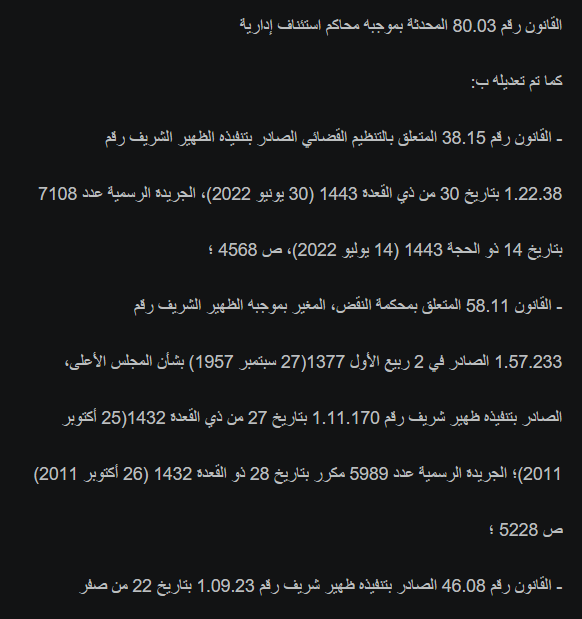
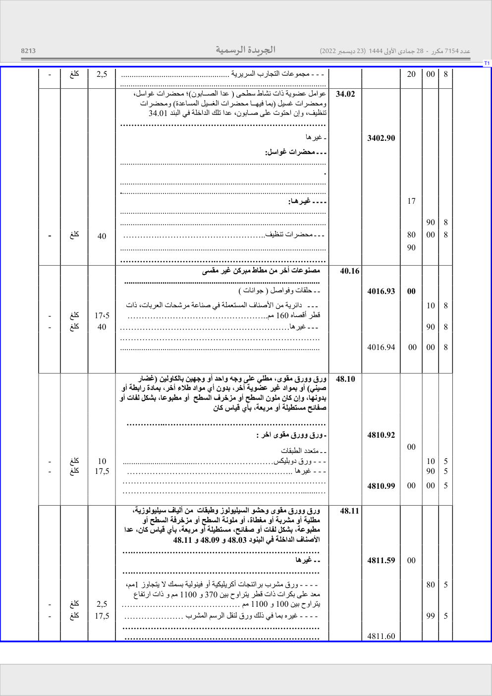
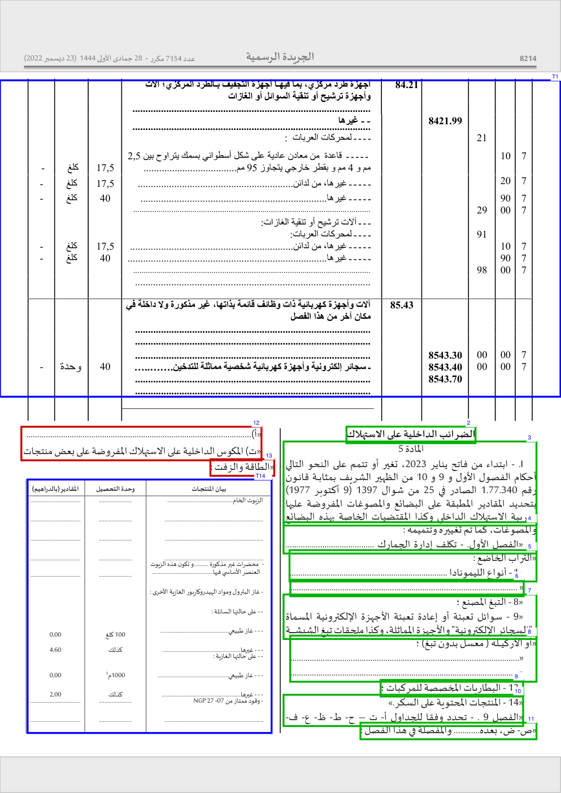
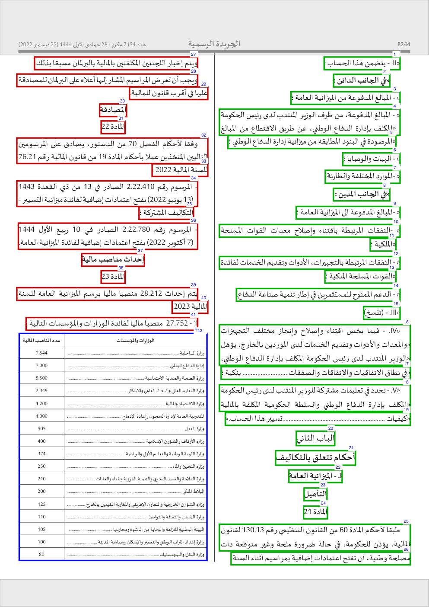
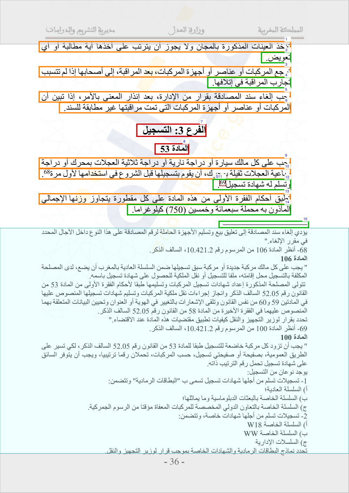
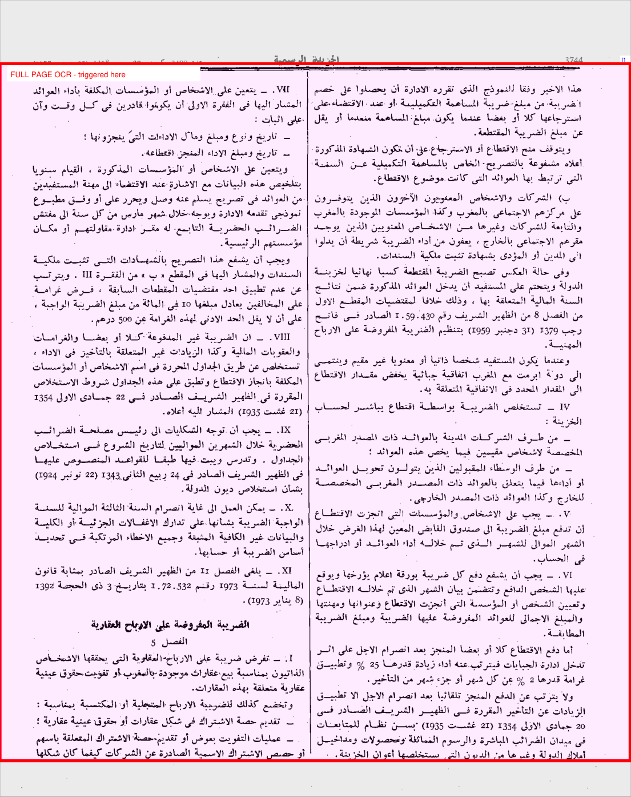
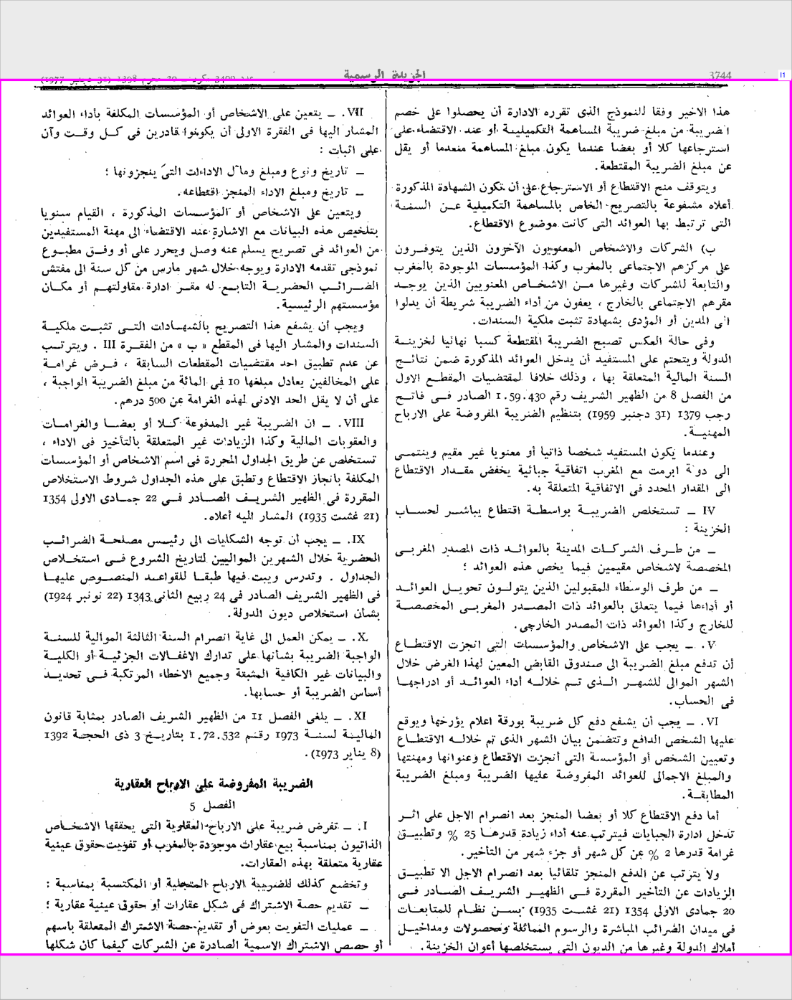
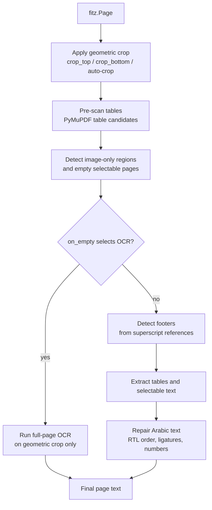
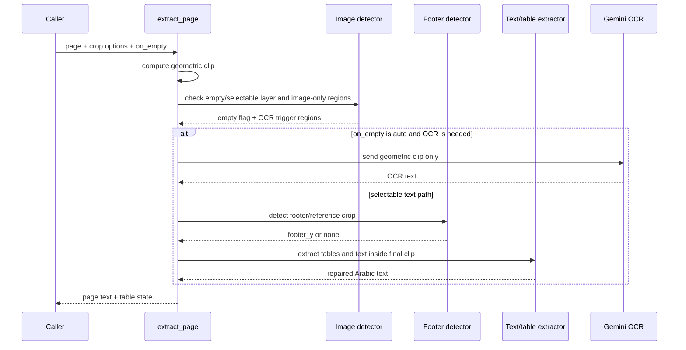
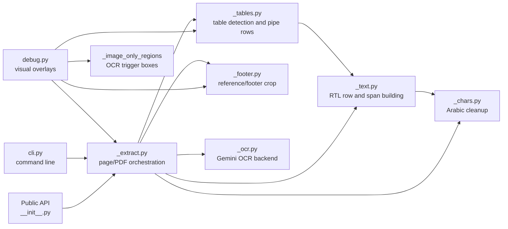

# PDF2Text-Arabic

Arabic-first PDF extraction for official documents, legal texts, financial laws, scanned pages, mixed Arabic/French tables, and footnote-heavy PDFs.

Python `>=3.13` | CLI and Python API | Optional Gemini OCR | Visual debug overlays

`pdf2text-arabic` uses PyMuPDF as the base engine, then adds Arabic-specific layout repair: RTL reading order, ligature cleanup, table reconstruction, footnote/footer cropping, page-header cropping, and optional Gemini OCR for scanned or image-heavy pages.

## Why This Exists

Raw PDF extraction is fast, but it often fails on Arabic legal PDFs:

- Arabic words can be reversed or split by glyph order.
- `لا`, `الله`, presentation forms, and mixed Arabic/French text can be broken.
- Tables can lose rows, merge columns, or mix Arabic and numeric cells.
- Footnotes and official reference blocks can be mixed into body text.
- Scanned pages can return empty or misleading selectable text.
- Debugging extraction problems is hard without seeing the page geometry.

This library treats the page as a 2D layout problem, then rebuilds text for search, RAG, legal analysis, and automation.

## Feature Showcase

These examples were selected from the project debug output because they show different failure modes the library handles.

### Clean Text Output (RAG-Ready)

The extractor's primary goal is to produce perfectly ordered Arabic text and structured tables without any visual noise. This makes it ideal for LLM pipelines and RAG (Retrieval-Augmented Generation).



### Long Official Tables

Selected from `قانون-المالية-2023/page_023.png` because it shows a large bordered table that spans nearly the whole page. The extractor keeps the table as pipe-separated rows instead of trying to turn it into markdown.



### Side-by-side and Multi-region Tables

Selected from `قانون-المالية-2023/page_024.png` because it has separate table regions and surrounding text. The goal is to avoid merging unrelated regions into one bad grid.



### Embedded Tables Inside Articles

Selected from `قانون-المالية-2023/page_054.png` because it mixes article text and a small table. The extractor detects the table without converting the full page into a table.



### Footnotes and Footer Cropping

Selected from `naw/page_036.png` because it shows superscript reference tips in the body and the reference block at the bottom. The footer area is removed from the body output.



### Full-page OCR for Scanned Pages

Selected from the royal speech document because the page is effectively image-based. With `on_empty="auto"`, the library selects the full geometric crop for OCR. Footer detection is not allowed to shrink this OCR box.



### Image Region Debugging Without OCR

Selected from the 1978 finance law with `on_empty="ignore"` to show image-only regions without forcing OCR. This is useful when you want to inspect what would trigger OCR.



### The Zero-Width Ligature Coordinate Fix (Native RTL Sorting)

Standard PDF extractors struggle massively with Arabic ligatures like **`لا`** (Lam-Alef) and **`لم`** (Lam-Meem) because PDF encoders often draw the second character as an invisible "zero-width" marker placed on the far right edge of the base character. In Right-To-Left (RTL) sorting, standard engines sort this zero-width character *first*, destroying the meaning of the word (e.g., extracting `الملاحية` as `المالحية` and `البرلمان` as `البرملان`). 

Furthermore, this extreme right-hand coordinate artificially inflates the gap to the next character, causing standard engines to mistakenly split words (e.g., `السلامة` splits into `السلا مة`).

**pdf2text-arabic** solves this "outside the box" natively. During extraction, it mathematically detects overlapping zero-width characters and recalculates their bounding boxes, automatically curing 99.9% of Arabic OCR inversions and spacing drops without relying on a dictionary:

> ❌ **Standard Engine:**
> 
> وترتيبات <span style="color:red; font-weight:bold">االنقاذ</span>، والمعدات <span style="color:red; font-weight:bold">المالحية</span> السفينية، والمطبوعات <span style="color:red; font-weight:bold">المالحية</span>، ووسائل
> 
> واجهزة ونظم الوقاية من الحرائق و<span style="color:red; font-weight:bold">السالمة</span> الحرائقية، ومعدات وترتيبات
> 
> <span style="color:red; font-weight:bold">تتماش ى</span> تًماما مع متطلبات هذه <span style="color:red; font-weight:bold">الالئحة</span> ومع القوانين والمراسيم و<span style="color:red; font-weight:bold">األوامر</span>

> ✅ **pdf2text-arabic:**
> 
> وترتيبات <span style="color:green; font-weight:bold">الانقاذ</span>، والمعدات <span style="color:green; font-weight:bold">الملاحية</span> السفينية، والمطبوعات <span style="color:green; font-weight:bold">الملاحية</span>، ووسائل
> 
> وأجهزة ونظم الوقاية من الحرائق و<span style="color:green; font-weight:bold">السلامة</span> الحرائقية، ومعدات وترتيبات
> 
> <span style="color:green; font-weight:bold">تتماشى</span> تًماما مع متطلبات هذه <span style="color:green; font-weight:bold">اللائحة</span> ومع القوانين والمراسيم و<span style="color:green; font-weight:bold">الأوامر</span>

## What It Fixes

| Problem | What the library does |
|---|---|
| Broken Arabic ligatures | Repairs decomposed ligatures and lam-alef ordering. |
| Arabic presentation forms | Normalizes presentation-form characters to standard Arabic. |
| Wrong RTL order | Reorders characters, spans, rows, and blocks for Arabic reading order. |
| Reversed numeric runs | Keeps values such as `2023`, `1.14.44`, and `200.000` readable. |
| Split visual rows | Merges PyMuPDF raw lines that visually belong to one row. |
| Mixed Arabic/French text | Preserves Arabic base direction while keeping Latin words and numbers usable. |
| Weak-border tables | Uses targeted fallback detection when default PyMuPDF misses rows. |
| Side-by-side tables | Uses bounding boxes so separate regions do not collapse into one grid. |
| Footnotes and references | Detects superscript tips and crops matching footer reference blocks. |
| Scanned/image pages | Supports `warn`, `ignore`, `auto`, and `ocr` handling. |
| Debugging extraction | Renders color-coded overlays for text, tables, footers, superscripts, and OCR. |

## How It Works

The extractor first decides whether the page can be handled from the selectable text layer. If `on_empty="auto"` selects OCR, the OCR image uses only the geometric crop settings. Footer detection is skipped for that OCR path.



The sequence below shows the important control point: `auto` OCR is decided before footer detection. If a page needs full-page OCR, the footer detector is not allowed to crop the OCR image.



## Architecture

The package is intentionally small. `_extract.py` is the orchestrator; the other modules each own one layout concern.



## Quick Setup

The easiest way to get started is by installing the package directly from PyPI.

```bash
pip install pdf2text-arabic
```

### Install from source

```bash
git clone https://github.com/TajEddineMarmoul/PDF2Text-Arabic.git
cd PDF2Text-Arabic
pip install .
```

The current package configuration requires Python `>=3.13`.

## Quick Start

### 1. Extract a PDF

```python
from pdf2text_arabic import extract_pdf

text = extract_pdf("document.pdf")
print(text)
```

### 2. Use the Recommended Defaults Explicitly

```python
from pdf2text_arabic import extract_pdf

text = extract_pdf(
    "document.pdf",
    crop_top=8.0,
    crop_bottom=4.5,
    crop_unit="pct",
    auto_crop_top=True,
    auto_crop_bottom=True,
    detect_footer=True,
    on_empty="warn",
)
```

### 3. Extract One Page

`extract_page()` returns `(text, last_table_state)`.

```python
import fitz
from pdf2text_arabic import extract_page

with fitz.open("document.pdf") as doc:
    text, _ = extract_page(doc[0])

print(text)
```

### 4. Get Structured Metadata

Use `extract_pdf_result()` when you need page-level metadata and warnings.

```python
from pdf2text_arabic import extract_pdf_result

result = extract_pdf_result("document.pdf", on_empty="warn")

print(result.pages_total)
print(result.pages_with_text)
print(result.empty_pages)
print(result.mixed_pages)
print(result.warnings)
print(result.text)
```

### 5. Choose the Right Mode

| Situation | Use |
|---|---|
| Text PDFs and no OCR key configured | `on_empty="warn"` |
| You want to inspect the selectable layer only | `on_empty="ignore"` |
| OCR is configured and scanned pages matter | `on_empty="auto"` |
| Every page should go through OCR | `on_empty="ocr"` |
| Legal PDFs with numbered references | `detect_footer=True` |
| You need footnotes kept in the output | `detect_footer=False` |

## OCR Modes

`on_empty` controls what happens when a page has missing selectable text or image-only content.

| Mode | Behavior |
|---|---|
| `warn` | Default extraction mode. Warns/skips pages that need OCR instead of silently returning partial text. |
| `ignore` | Does not call OCR. Useful when you want to inspect the selectable layer or debug image regions. |
| `auto` | If the page has image-only content or no reliable selectable text, sends the cropped full page to OCR. |
| `ocr` | Forces OCR for the cropped full page. |

Important: full-page OCR uses only the geometric crop from `crop_top`, `crop_bottom`, `crop_unit`, `auto_crop_top`, and `auto_crop_bottom`. It does not use `detect_footer` to shrink the OCR image. This protects scanned pages from false footer crops.

OCR uses Gemini through `google-genai`. Set `GEMINI_API_KEY` in the environment or `.env` before using `auto` or `ocr`.

```bash
set GEMINI_API_KEY=your_key_here
pdf2text-arabic -f scanned.pdf --on-empty auto
```

```python
from pdf2text_arabic import extract_pdf, get_capabilities

caps = get_capabilities()
if caps["ocr"]:
    text = extract_pdf("scanned.pdf", on_empty="auto")
else:
    text = extract_pdf("scanned.pdf", on_empty="warn")
```

## Table Output Format

Tables are written as plain text rows using ` | ` separators.

```text
الوزارة أو المؤسسة | عدد المناصب المالية
وزارة الداخلية | 7.544
إدارة الدفاع الوطني | 7.000
وزارة الصحة والحماية الاجتماعية | 5.500
```

This is intentionally not markdown:

- Empty cells remain visible as consecutive separators.
- Rows stay self-contained for downstream parsing.
- Complex Arabic/French/numeric cells remain in text form.
- The extractor avoids inventing headers when the PDF does not provide reliable headers.

## Footer Detection

Footer detection is designed for official documents with numbered references. It uses signals such as:

- Superscript reference tips in the body.
- Matching footer lines such as `167 - ...`.
- Footer separators drawn as lines or text.
- Same-font backtracking when the footer begins above the first numbered reference line.

The conservative rule is: if there is no reliable reference signal, the extractor should avoid cropping based on separators alone. This protects pages where `---`, `___`, dotted rows, or table rules are body content.

## Debug Overlay

Use the debug renderer to understand extraction decisions visually.

```python
import fitz
from pdf2text_arabic.debug import get_debug_pixmap

with fitz.open("document.pdf") as doc:
    pix = get_debug_pixmap(doc[0], dpi=120, on_empty="auto")
    pix.save("debug_page_001.png")
```

Overlay colors:

| Color | Meaning |
|---|---|
| Blue | Detected table region. |
| Cyan | Footer/reference area cropped from body output. Not shown when `auto` selects full-page OCR. |
| Magenta | Image-only/OCR region or full-page OCR selection. |
| Red outline on OCR page | The region that triggered full-page OCR. |
| Maroon | Superscript reference tip. |
| Orange | Wide text row. |
| Green | Right-column text row. |
| Red | Left-column text row or heading/article block. |
| Grey | Header/footer geometric crop band. |

Debug defaults to `on_empty="auto"`. If full-page OCR is selected, PyMuPDF text/table boxes are hidden because they are not used in the final OCR output.

## CLI

```bash
# Process every PDF in ./download into ./output/plain_text
pdf2text-arabic -i ./download -o ./output/plain_text

# Process one file
pdf2text-arabic -f document.pdf -o ./output/plain_text

# Disable footer detection
pdf2text-arabic -f document.pdf --no-footer

# Use OCR automatically for image-heavy pages
pdf2text-arabic -f scanned.pdf --on-empty auto

# Avoid OCR and use only the selectable text layer
pdf2text-arabic -f document.pdf --on-empty ignore
```

## API Reference

### `extract_pdf(pdf_path, **kwargs) -> str`

Extract all pages and return one text string.

| Parameter | Type | Default | Description |
|---|---|---:|---|
| `pdf_path` | `str` | required | PDF path. |
| `crop_top` | `float` | `8.0` | Crop amount from the top. |
| `crop_bottom` | `float` | `4.5` | Crop amount from the bottom. |
| `crop_unit` | <code>"px" &#124; "pct"</code> | `"pct"` | Crop values as points or page-height percent. |
| `auto_crop_top` | `bool` | `True` | Auto-adjust top crop for repeated headers/page numbers. |
| `auto_crop_bottom` | `bool` | `True` | Auto-adjust bottom crop for page numbers. |
| `detect_footer` | `bool` | `True` | Detect and remove footnote/reference footers for selectable-text extraction. |
| `on_empty` | <code>"ignore" &#124; "warn" &#124; "auto" &#124; "ocr"</code> | `"warn"` | OCR/image-page handling. |
| `table_strategy` | <code>str &#124; None</code> | `None` | Optional PyMuPDF table strategy, for example `"lines"`, `"lines_strict"`, or `"text"`. |
| `gemini_model` | `str` | `"gemini-3-flash-preview"` | Gemini model for OCR. |

### `extract_page(page, **kwargs) -> tuple[str, dict | None]`

Extract one `fitz.Page`. It accepts the same extraction options except `pdf_path`.

### `extract_pdf_result(pdf_path, **kwargs) -> ExtractionResult`

Returns structured metadata:

- `text`
- `pages_total`
- `pages_with_text`
- `empty_pages`
- `mixed_pages`
- `warnings`

### `get_capabilities() -> dict`

Reports optional runtime features such as OCR availability.

```python
from pdf2text_arabic import get_capabilities

print(get_capabilities())
```

## Project Structure

```text
pdf2text_arabic/
├── __init__.py    # Public API
├── _chars.py      # Arabic character and ligature helpers
├── _extract.py    # Page/PDF extraction orchestration
├── _footer.py     # Footnote/footer detection
├── _ocr.py        # Gemini OCR backend
├── _tables.py     # Table detection and pipe-format output
├── _text.py       # RTL text building and line merging
└── debug.py       # Visual debug overlay renderer
```

## Practical Guidance

- Use `extract_pdf_result()` for agents and automation.
- Use `on_empty="warn"` when OCR is not configured.
- Use `on_empty="auto"` when `GEMINI_API_KEY` is configured and scanned pages matter.
- Use `on_empty="ignore"` when you want to inspect what the selectable layer alone provides.
- Keep `detect_footer=True` for official legal documents with numbered references.
- Disable footer detection only if you explicitly need footnotes mixed into the body.
- Use debug PNGs before changing extraction thresholds; most problems are page-layout specific.

## Limitations

- OCR requires a configured Gemini API key.
- The extractor is slower than raw `page.get_text("text")` because it reads geometry, font data, tables, image regions, and character-level layout.
- Table output is plain separator text, not markdown and not a spreadsheet format.
- Footer detection is conservative. If the page does not expose enough reliable reference signals, the extractor may keep footer-like text rather than risk deleting body text.
- Some PDFs contain broken or misleading selectable text layers. Use `on_empty="auto"` and debug overlays for those files.

## Development Notes

The visual test workflow renders `.txt` and debug `.png` files under `output/all_pages/`:

```bash
python test_all_pages.py
```

Generated `output/` and `download/` folders are ignored by git. Curated README images live in `assets/`.

## Contributing

Small, page-specific fixes should start with a debug image and a focused reproduction script. This project works with layout edge cases, so broad heuristics should be avoided unless they are tested against several documents.

Recommended workflow:

```bash
python -m compileall pdf2text_arabic
python test_all_pages.py
```

When changing extraction logic, compare the before and after `.txt` and `.png` output for known difficult pages. Keep changes narrow and document the page that motivated the change.

## Security

Do not commit `.env`, API keys, downloaded PDFs with private data, or generated `output/` files. The `.gitignore` already excludes `download/`, `output/`, notebooks, PNG test renders outside `assets/`, and `.env`.

If you use OCR, page images are sent to the configured Gemini model. Do not enable OCR for documents that cannot leave your environment.

## License

MIT. See `LICENSE`.
